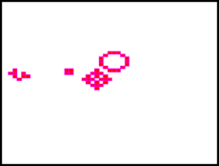

# hpprime
This project contains a collection of projects for the HPPrime graphing calculator

## GameOfLife
Implementation of John Conway's Game of Life for the HPPrime. When the application starts, the user needs to enter the grid size to render (40x40 is a good starting point). For now the starting pattern is hard coded as an r-pentomino in the center of the screen. A starting pattern selection feature is planned.

Generation 49 of an r-pentomino
